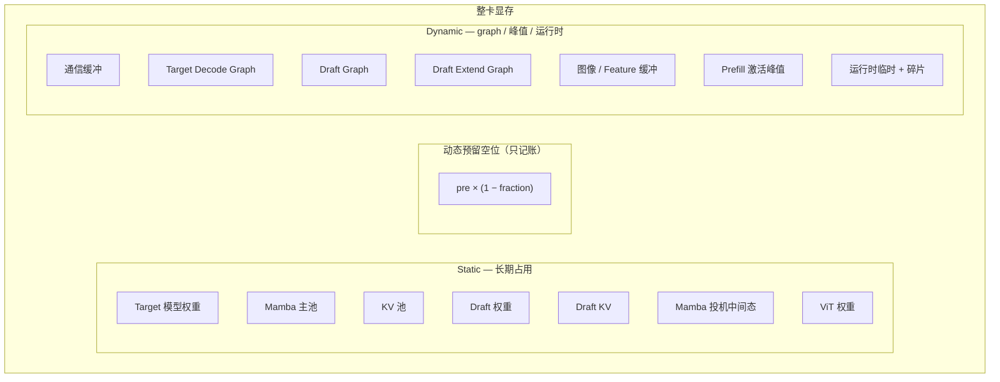
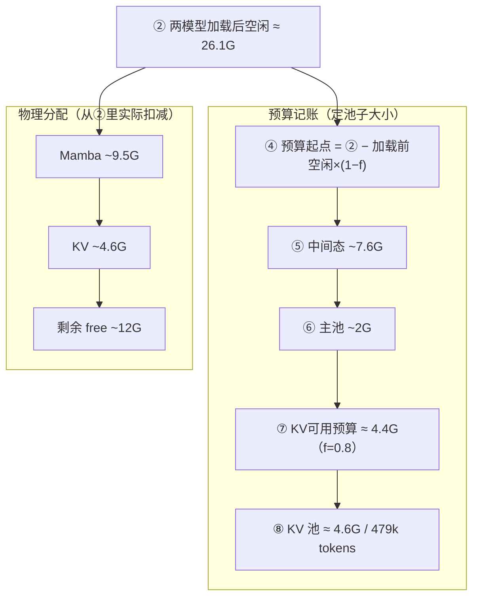

# 显存预算与 Prefill 调度

> 关联文档：[Prefill vs Decode](./prefill-decode.md)、[投机推理](./speculative-decoding.md)、[CUDA Graphs](./cuda-graphs.md)

---

## 1. Static vs Dynamic（组件名）



| 组件 | Static | Dynamic |
|------|--------|---------|
| 主模型 | 权重 | — |
| Mamba | 主池、投机中间态 | — |
| KV | KV 池 | — |
| 投机推理模型 | Draft 权重、 KV | Draft / Extend Graph |
| CUDA Graph | — | 主模型 Decode Graph |
| 多模态 | ViT 权重 | 图像 / Feature 缓冲 |
| Prefill | — | 激活峰值 |
| 通信 | — | HCCL 等 |
| 内存预算 | — | `pre×(1−fraction)` 仅预留 |

---

## 2. 启动时 KV 池怎么定（Concrete Example）

调用链（[`scheduler.py#L862`](https://github.com/sgl-project/sglang/blob/main/python/sglang/srt/managers/scheduler.py#L862) — `init_model_worker()`）：

```
init_model_worker()                    # scheduler
  ├─ init_tp_model_worker()            # 加载主模型权重，记录加载前空闲
  ├─ maybe_init_draft_worker()         # 加载 draft 模型权重
  └─ init_memory_pools()              # 协调所有 worker 分配内存池
       └─ tp_worker.alloc_memory_pool()
            └─ model_runner.alloc_memory_pool()
                 └─ _resolve_memory_pool_config()   # 测量加载后空闲，算 KV 预算
                      └─ _init_pools()              # 实际分配 KV + Mamba 池
```

> **关键**：`_profile_available_bytes()` 在 `alloc_memory_pool()` 内调用，此时主模型和 draft 模型均已加载完毕，`available_gpu_memory` 反映两者共同占用后的剩余显存，比仅加载主模型后少约 1.84 GB（draft 权重占用）。

### 2.1 公式与源码

```
# pre = 加载任何权重前的可用显存（init_torch_distributed 末尾测量）
# post = 主模型+draft 模型全部加载后的可用显存（alloc_memory_pool 时测量）

reserve_gb   = pre × (1 − mem_fraction_static)     ← 动态预留空位，不 malloc
rest_gb      = post − reserve_gb
rest_gb      −= Mamba 投机中间态（若开投机）
rest_gb      −= Mamba 主池
available_bytes = rest_gb × 2³⁰
KV tokens    = (available_bytes // cell_size) 按 page 对齐
final tokens = min(KV tokens, max_total_tokens)    ← 若设置了 cap
```

#### ① 测 `pre`（加载任何模型前）

[`model_runner.py#L1282`](https://github.com/sgl-project/sglang/blob/main/python/sglang/srt/model_executor/model_runner.py#L1282) — `init_torch_distributed()` 末尾：

```python
pre_model_load_memory = get_available_gpu_memory(
    self.device,
    self.gpu_id,
    distributed=get_world_group().world_size > 1,
    cpu_group=get_world_group().cpu_group,
)
return pre_model_load_memory
```

#### ② 动态预留 + `rest`（主模型 + draft 模型均加载完之后）

[`model_runner_kv_cache_mixin.py#L85`](https://github.com/sgl-project/sglang/blob/main/python/sglang/srt/model_executor/model_runner_kv_cache_mixin.py#L85) — `_profile_available_bytes()`：

```python
# 此时主模型和 draft 模型均已加载，available_gpu_memory 比仅加载主模型时更小
available_gpu_memory = get_available_gpu_memory(
    self.device,
    self.gpu_id,
    distributed=get_world_group().world_size > 1,
    cpu_group=get_world_group().cpu_group,
)

rest_memory = available_gpu_memory - pre_model_load_memory * (
    1 - self.mem_fraction_static
)

if self.mambaish_config is not None:
    rest_memory = self.handle_max_mamba_cache(rest_memory)

return int(rest_memory * (1 << 30))
```

#### ③ Mamba 投机中间态（从 `rest` 里扣预算）

[`model_runner_kv_cache_mixin.py#L138`](https://github.com/sgl-project/sglang/blob/main/python/sglang/srt/model_executor/model_runner_kv_cache_mixin.py#L138) — `handle_max_mamba_cache()`，显式指定 `max_mamba_cache_size` 且开投机时：

```python
if has_spec_dec:
    ratio = self._calculate_mamba_ratio()
    capped_reqs = min(
        server_args.max_running_requests
        // (self.dp_size if server_args.enable_dp_attention else 1),
        server_args.max_mamba_cache_size // ratio,
    )
    intermediate_size = (
        config.mamba2_cache_params.mamba_cache_per_req
        * capped_reqs
        * server_args.speculative_num_draft_tokens
    )
    total_rest_memory = total_rest_memory - (intermediate_size / (1 << 30))
```

#### ④ Mamba 主池（继续从 `rest` 里扣预算）

[`model_runner_kv_cache_mixin.py#L219`](https://github.com/sgl-project/sglang/blob/main/python/sglang/srt/model_executor/model_runner_kv_cache_mixin.py#L219)：

```python
mamba_state_memory = (
    server_args.max_mamba_cache_size
    * config.mamba2_cache_params.mamba_cache_per_req
    / (1 << 30)
)
return total_rest_memory - mamba_state_memory
```

#### ⑤ `rest` → KV token 数

[`pool_configurator.py#L222`](https://github.com/sgl-project/sglang/blob/main/python/sglang/srt/model_executor/pool_configurator.py#L222) — `DefaultPoolConfigurator.calculate_pool_sizes()`：

```python
def calculate_pool_sizes(
    self, available_bytes: int, page_size: int
) -> MemoryPoolConfig:
    max_total_num_tokens = available_bytes // self._cell_size
    max_total_num_tokens = max_total_num_tokens // page_size * page_size
    return MemoryPoolConfig(max_total_num_tokens=max_total_num_tokens)
```

入口在 [`_resolve_memory_pool_config()`](https://github.com/sgl-project/sglang/blob/main/python/sglang/srt/model_executor/model_runner_kv_cache_mixin.py#L1051)：

```python
available_bytes = self._profile_available_bytes(pre_model_load_memory)
configurator = create_memory_pool_configurator(self)
config = configurator.calculate_pool_sizes(available_bytes, page_size)
```

#### ⑥ `max_total_tokens` 上限（--max-total-tokens）

[`model_runner_kv_cache_mixin.py#L952`](https://github.com/sgl-project/sglang/blob/main/python/sglang/srt/model_executor/model_runner_kv_cache_mixin.py#L952) — `_apply_token_constraints()`：

```python
user_limit = self.server_args.max_total_tokens

if user_limit is not None:
    if user_limit > token_capacity:
        logging.warning(
            f"max_total_tokens={user_limit} is larger than the profiled value "
            f"{token_capacity}. Use the profiled value instead."
        )
    token_capacity = min(token_capacity, user_limit)

return token_capacity
```

[`_resolve_memory_pool_config()`](https://github.com/sgl-project/sglang/blob/main/python/sglang/srt/model_executor/model_runner_kv_cache_mixin.py#L1063) 里调用：

```python
constrained = self._apply_token_constraints(config.max_total_num_tokens)
if constrained != config.max_total_num_tokens:
    config = configurator.calculate_pool_sizes_from_max_tokens(
        constrained, page_size
    )
```

**注意**：`min(cap, profiled)` 只能**缩小**池子；cap 大于 profiled 时打 warning，仍用 profiled 值。

### 2.2 实测数字（Qwen3.6-35B-A3B，TP=2，NPU）

**⑦ = ④ − ⑤ − ⑥**，**KV 池大小由 ⑦ 决定**，不是「加载后空闲减 Mamba 剩下的 free」。

#### 关键：加载后空闲已含 draft 权重

```
加载后空闲 ≈ 26.09 GB   ← 主模型 + MTP draft 均加载完后的空闲（不是整卡 60G）
③ = 加载前空闲 × (1−f)  ← 只在算 KV 预算时从②扣掉，不是再占一块物理显存
④ = 加载后空闲 − ③      ← ③ 只在这里出现一次
⑦ = ④ − ⑤ − ⑥         ← 全部给 KV 预算
⑧ = ⑦ 换成 bytes ÷ cell_size
```

#### Case A：实测（fraction = **0.8**）→ 479488 tokens

| 步骤 | 计算 | 数值 |
|------|------|------|
| ① 加载前空闲 | | **60.77 GB** |
| ② 两模型加载后空闲 | | **26.09 GB** |
| ③ 动态预留 | 60.77 × (1−0.8) | **12.15 GB** |
| ④ 预算起点 | 26.09 − 12.15 | **13.94 GB** |
| ⑤ Mamba 中间态 | | **7.55 GB** |
| ⑥ Mamba 主池 | | **1.97 GB** |
| **⑦ KV 可用预算** | 13.94 − 7.55 − 1.97 | **≈ 4.42 GB** |
| ⑧ KV 池 | 479488 tokens × 10240 | **≈ 4.57 GB** |

（⑦ 与 ⑧ 的微小差异来自 mamba_cache_per_req 内部精度取整。）

#### Case B：若 fraction = **0.9**（同一机器，只改 fraction）

| 步骤 | 计算 | 数值 |
|------|------|------|
| ③ 动态预留 | 60.77 × (1-0.9) | **6.08 GB** |
| ④ 预算起点 | 26.09 − 6.08 | **20.01 GB** |
| ⑤⑥ Mamba | 同左 | **7.55 + 1.97 = 9.52 GB** |
| **⑦ KV 可用预算** | 20.01 − 9.52 | **≈ 10.49 GB** |
| ⑧ KV 池（估） | 10.49×2³⁰÷10240 | **≈ 1.10M tokens** |

0.9 时 KV 预算 ~10.5G，约是 0.8 时的 **2.4 倍**。

#### ⑩ 池分配后剩余 free ≈ 11G 是什么？

这是 **KV + Mamba 真分配完之后** 的物理空闲，**不是** ⑦：

```
② 两模型加载后空闲       26.09 GB
  − Mamba 真分配          ~9.52 GB
  − KV 真分配            ~4.57 GB   ← 由 ⑦ 决定
─────────────────────────────────
剩余 free               ~12 GB     ← 给 Graph 等用
```

**~12G 是「池子分完还剩多少 free」；4.57G 是「KV 池分到多少」——两个不同量。**



### 2.3 参考数值（Qwen3.6-35B-A3B，TP=2，NPU，fraction=0.8）

| 含义 | 代码变量 | 值 |
|------|---------|-----|
| ① 加载前空闲 | `pre_model_load_memory` | 60.77 GB |
| ② 两模型加载后空闲 | `available_gpu_memory` | 26.09 GB |
| ③ 动态预留 | `pre_model_load_memory × (1−f)` | 12.15 GB |
| ④ 预算起点 | `rest_memory`（扣③后） | 13.94 GB |
| ⑤ Mamba 中间态 | — | 7.55 GB |
| ⑥ Mamba 主池 | — | 1.97 GB |
| ⑦ KV 可用预算 | `rest_memory`（扣⑤⑥后） | **≈ 4.42 GB** |
| ⑧ KV 池（实分配） | — | **479488 tokens ≈ 4.57 GB** |
| 池分配后剩余 free | — | **~12 GB** |
| NPU graph | — | **~1.3 GB** |

要点：

- **draft 模型（~1.84 GB）已计入②**，所以②= 26.09 GB 而非 27.93 GB。
- fraction **0.9** 会把 ④ 从 13.94 抬到 20.01，⑦ 抬到 **~10.49G**，KV 池约 **1.10M tokens**。
- 若同时加 `--max-total-tokens N`，则 `min(profiled, N)` 决定最终池大小（只能缩小，不能扩大）。

---

## 3. 运行时：PrefillAdder 在哪判断？

| 阶段 | 文件 | 函数 |
|------|------|------|
| 调度入口 | `scheduler.py` | `get_next_batch_to_run()` → `get_new_batch_prefill()` |
| 组 batch | `scheduler.py` | `_get_new_batch_prefill_raw()` |
| 准入判断 | `schedule_policy.py` | `PrefillAdder.add_one_req()` |

### 3.1 剩余 token 预算

```python
rem_total_tokens = pool.available_size() + tree_cache.evictable_size() - offset
```

- `disable-radix-cache` 时 **evictable = 0**。
- 每条请求准入检查：`input + max_new + page_size` 不能超过 `rem_total_tokens`。
- 加入后 `offset` 增加（含未来 output 预留）。

### 3.2 返回值

| 结果 | 含义 | 调度器 |
|------|------|--------|
| `CONTINUE` | 还能加 | 继续扫队列 |
| `NO_TOKEN` | KV 池不够 | `batch_is_full=True`，**break** |
| `OTHER` | 触达 `prefill-max-requests` / `max-prefill-tokens` 等 | **break** |

`get_next_batch_to_run` **优先 prefill**；`get_new_batch_prefill()` 返回 `None`（含 `batch_is_full`）才 decode。

### 3.3 日志字段对照

| 日志 | 来源 | 与 PrefillAdder |
|------|------|-----------------|
| `full token usage` | `pool_stats_observer.py` | 同一 KV 池的 `used/size`，Adder 用 `available` |
| `#queue-req` | scheduler | `waiting_queue` 长度 |
| `#running-req` | scheduler | `running_batch` 长度 |

---

## 4. Case：3.5k 输入，fraction=0.8，decode@94（失败形态）

### 4.1 启动参数摘要

```
mem-fraction-static 0.8
max-running-requests 122
max-mamba-cache-size 122
prefill-max-requests 12
disable-radix-cache          → Mamba ratio=1，evictable=0
无 max-total-tokens
```

### 4.2 日志摘要

| 阶段 | 现象 |
|------|------|
| Prefill | 1 + 12×7 + **9** = **94** 路进 running |
| 最后一轮 prefill | 只加了 **9** 条（不是 12），`full token usage: 0.70` |
| Decode | **#running-req: 94**，**#queue-req: 28** 一直不降 |
| 池子 | `#full token: 347392`，`usage: 0.72` → 池约 **483k tokens** |

### 4.3 根因链

```
fraction 0.8 → KV 池约 48 万 token（0.9 时约 110 万）
    ↓
每条 3.5k 输入准入约需 input+max_new+page ≈ 5128 token
122 路全占需 ≈ 62 万 token 预算 → 池物理上不够
    ↓
Prefill 到 94 路时 usage≈0.70，再加第 10～12 条 → NO_TOKEN
    ↓
batch_is_full → 不再组 prefill → decode@94
    ↓
28 条留在 waiting_queue（#queue-req: 28）
```

**不是 Mamba 卡住**：`disable-radix-cache` + ratio=1 → 122 槽可用，decode 时 `mamba num: 94`（未满 122）。

**是 KV 池偏小 + PrefillAdder `NO_TOKEN`**。

### 4.4 与稳定 case 对比

| | 3.5k 失败 (0.8) | 3.5k 稳定 (0.9) | 3.5k 稳定 (0.9 + max-total-tokens 659840) |
|--|-----------------|-----------------|------------------------------------------|
| KV 池 | ~479k tokens | ~1100k tokens | ~660k tokens |
| Prefill 完成 | 94 / 122 | 122 / 122 | 122 / 122 |
| Decode | @94，queue 28 | @122 | @122 |
| 剩余 free | ~12 GB | ~6 GB | ~10 GB |

单条准入估算（output 1500）：

```
3500 + 1500 + 128 ≈ 5128 token / 请求
94 × 5128 ≈ 481k  → 与 0.70×479k 一致
```

---

## 5. Case：64k 输入，decode@32（Mamba 限制）

启动：`max-running-requests 40`，`max-mamba-cache-size 160`，`extra_buffer`（ratio=5），`fraction 0.71`。

```
有效并发 = min(40, 160÷5) = 32
```

日志：`#running-req: 32`，`#queue-req: 8` → **Mamba 槽位限制**，不是 KV 单独问题（与 3.5k@94 不同）。

---

## 6. 调参速查

| 目标 | 手段 |
|------|------|
| 增大 KV 池 | ↑ `mem-fraction-static`；可选 `max-total-tokens` cap |
| 更多路 decode | 查 `max-mamba-cache-size ÷ ratio`（radix/extra_buffer 影响 ratio） |
| 每轮 prefill 条数 | `prefill-max-requests` |
| 单轮 prefill token | `max-prefill-tokens` |
| 准入逻辑代码 | `schedule_policy.py` → `PrefillAdder` |

---

## 标签

`sglang` `显存` `KV-cache` `mem-fraction-static` `PrefillAdder` `调度` `mamba` `NPU`
