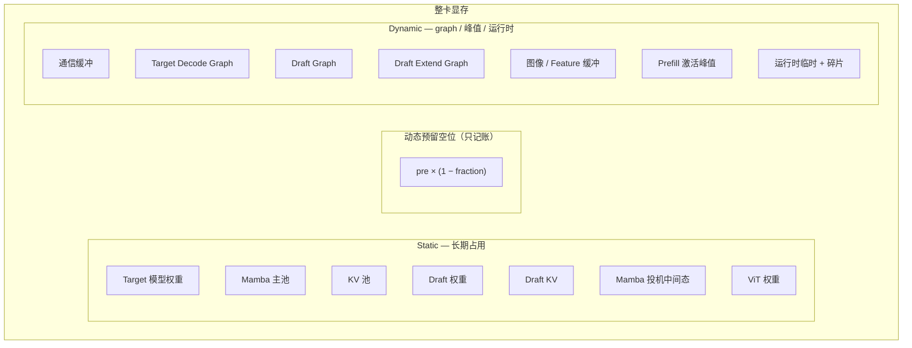
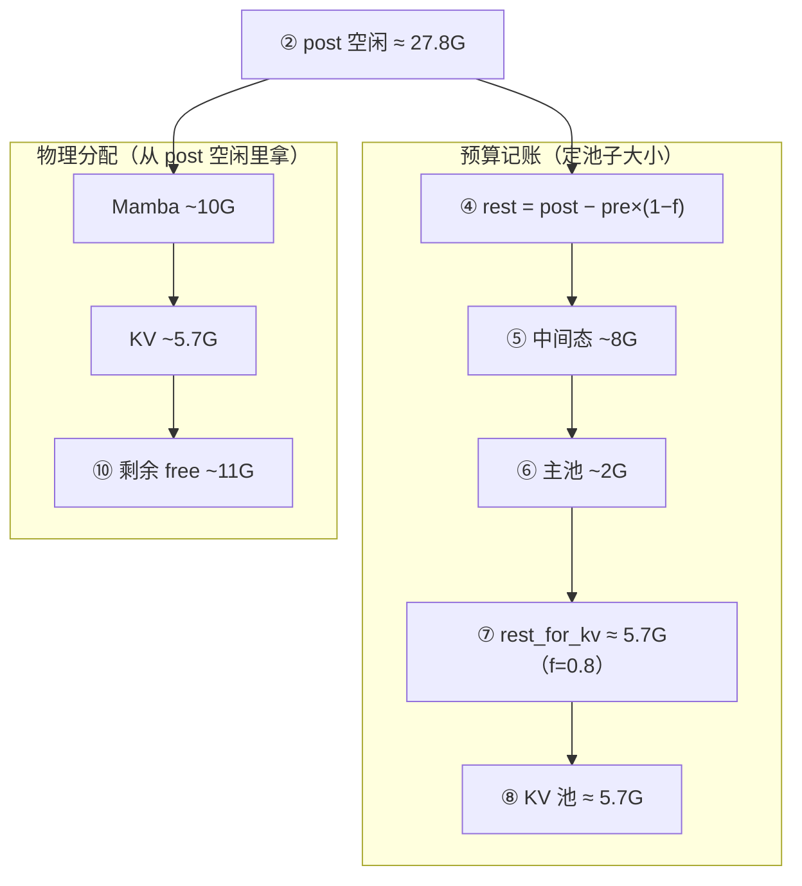

# 显存预算与 Prefill 调度

> 关联文档：[Prefill vs Decode](./prefill-decode.md)、[投机推理](./speculative-decoding.md)、[CUDA Graphs](./cuda-graphs.md)

---

## 1. Static vs Dynamic（组件名）



| 组件 | Static | Dynamic |
|------|--------|---------|
| 主模型 | 权重 | — |
| Mamba | 主池、投机中间态 | — |
| KV | KV 池 | — |
| 投机推理模型 | Draft 权重、 KV | Draft / Extend Graph |
| CUDA Graph | — | 主模型 Decode Graph |
| 多模态 | ViT 权重 | 图像 / Feature 缓冲 |
| Prefill | — | 激活峰值 |
| 通信 | — | HCCL 等 |
| 内存预算 | — | `pre×(1−fraction)` 仅预留 |

---

## 2. 启动时 KV 池怎么定（Concrete Example）

调用链：`init_torch_distributed()` 测 `pre` → `load_model()` → `_resolve_memory_pool_config(pre)` → `_init_pools()`。

### 2.1 公式与源码

```
reserve_gb   = pre × (1 − mem_fraction_static)     ← 动态预留空位，不 malloc
rest_gb      = post − reserve_gb
rest_gb      −= Mamba 投机中间态（若开投机）
rest_gb      −= Mamba 主池
available_bytes = rest_gb × 2³⁰
KV tokens    = (available_bytes // cell_size) 按 page 对齐
final tokens = min(KV tokens, max_total_tokens)    ← 若设置了 cap
```

#### ① 测 `pre`（加载模型前）

`model_runner.py` — `init_torch_distributed()` 末尾：

```python
pre_model_load_memory = get_available_gpu_memory(
    self.device,
    self.gpu_id,
    distributed=get_world_group().world_size > 1,
    cpu_group=get_world_group().cpu_group,
)
return pre_model_load_memory
```

#### ② 动态预留 + `rest`（加载模型后）

`model_runner_kv_cache_mixin.py` — `_profile_available_bytes()`：

```python
post_model_load_memory = get_available_gpu_memory(
    self.device,
    self.gpu_id,
    distributed=get_world_group().world_size > 1,
    cpu_group=get_world_group().cpu_group,
)

pre_non_static_gb = pre_model_load_memory * (
    1 - self.mem_fraction_static
)
rest_memory = post_model_load_memory - pre_non_static_gb

if self.mambaish_config is not None:
    rest_memory = self.handle_max_mamba_cache(rest_memory)

available_bytes = int(rest_memory * (1 << 30))
return available_bytes
```

#### ③ Mamba 投机中间态（从 `rest` 里扣预算）

`model_runner_kv_cache_mixin.py` — `handle_max_mamba_cache()`，开投机时：

```python
if has_spec_dec:
    ratio = self._calculate_mamba_ratio()
    capped_reqs = min(
        server_args.max_running_requests
        // (self.dp_size if server_args.enable_dp_attention else 1),
        server_args.max_mamba_cache_size // ratio,
    )
    intermediate_size = (
        config.mamba2_cache_params.mamba_cache_per_req
        * capped_reqs
        * server_args.speculative_num_draft_tokens
    )
    intermediate_gb = intermediate_size / (1 << 30)
    total_rest_memory = total_rest_memory - intermediate_gb
```

#### ④ Mamba 主池（继续从 `rest` 里扣预算）

```python
mamba_state_bytes = (
    server_args.max_mamba_cache_size
    * config.mamba2_cache_params.mamba_cache_per_req
)
mamba_state_memory = mamba_state_bytes / (1 << 30)
rest_out_gb = total_rest_memory - mamba_state_memory
return rest_out_gb
```

#### ⑤ `rest` → KV token 数

`pool_configurator.py` — `DefaultPoolConfigurator.calculate_pool_sizes()`：

```python
def calculate_pool_sizes(
    self, available_bytes: int, page_size: int
) -> MemoryPoolConfig:
    max_total_num_tokens = available_bytes // self._cell_size
    max_total_num_tokens = max_total_num_tokens // page_size * page_size
    return MemoryPoolConfig(max_total_num_tokens=max_total_num_tokens)
```

入口在 `_resolve_memory_pool_config()`：

```python
available_bytes = self._profile_available_bytes(pre_model_load_memory)
configurator = create_memory_pool_configurator(self)
cell_size = configurator._cell_size
config = configurator.calculate_pool_sizes(available_bytes, page_size)
```

#### ⑥ `max_total_tokens` 上限（--max_total_tokens）

`model_runner_kv_cache_mixin.py` — `_apply_token_constraints()`：

```python
user_limit = self.server_args.max_total_tokens

if user_limit is not None:
    if user_limit > token_capacity:
        logging.warning(
            f"max_total_tokens={user_limit} is larger than the profiled value "
            f"{token_capacity}. Use the profiled value instead."
        )
    token_capacity = min(token_capacity, user_limit)

return token_capacity
```

`_resolve_memory_pool_config()` 里调用：

```python
constrained = self._apply_token_constraints(config.max_total_num_tokens)
if constrained != config.max_total_num_tokens:
    config = configurator.calculate_pool_sizes_from_max_tokens(
        constrained, page_size
    )
final_max_tokens = config.max_total_num_tokens
```

**注意**：`min(cap, profiled)` 只能**缩小**池子；cap 大于 profiled 时打 warning，仍用 profiled 值。

### 2.2 实测数字：别把 fraction 混用

MemProfile 里 **⑦ = ④ − ⑤ − ⑥**（源码注释），**KV 池大小 = ⑦**，不是「21−10 剩下的 11」。

#### 关键：④ 里已经减过 ③

```
post ≈ 27.78 GB     ← 权重 load 完后的空闲（不是整卡 60G）
③  = pre × (1−f)   ← 只在算 KV 预算时从 post 上减掉，不是再占一块物理显存
④  = post − ③      ← ③ 只在这里出现一次
⑦  = ④ − ⑤ − ⑥   ← 全部给 KV 预算
⑧  = ⑦ 换成 bytes ÷ cell_size
```

**不存在**「27 减 6 得 21，再减 10 得 11，再减 6 得 5.7」这种链；**5.7 就是 ④−⑤−⑥ 的结果**。

#### Case A：MemProfile 实测（fraction = **0.8**）

这条日志对应 **593024 tokens / KV 5.66 GB**：

| 步骤 | 计算 | 数值 |
|------|------|------|
| ① pre | | **60.80 GB** |
| ② post | | **27.78 GB** |
| ③ 预留 | 60.80 × (1−0.8) | **12.16 GB** |
| ④ rest | 27.78 − 12.16 | **15.62 GB** |
| ⑤ Mamba 中间态 | | **7.97 GB** |
| ⑥ Mamba 主池 | | **1.99 GB** |
| **⑦ rest_for_kv** | 15.62 − 7.97 − 1.99 | **≈ 5.66 GB** |
| ⑧ KV 池 | 593024 × 10240 | **≈ 5.66 GB** |

验算：`15.62 − 7.97 − 1.99 = 5.56`（与 5.66 一致，四舍五入误差）。

#### Case B：若 fraction = **0.9**（同一 pre/post，只改 fraction）

| 步骤 | 计算 | 数值 |
|------|------|------|
| ③ 预留 | 60.80 × 0.1 | **6.08 GB** |
| ④ rest | 27.78 − 6.08 | **21.70 GB** |
| ⑤⑥ Mamba | 同左 | **7.97 + 1.99 = 9.96 GB** |
| **⑦ rest_for_kv** | 21.70 − 9.96 | **≈ 11.74 GB** |
| ⑧ KV 池（估） | 11.74×2³⁰÷10240 | **≈ 1.22M tokens** |

所以：**0.9 时 KV 预算应是 ~11.7G，不是 5.7G**。之前文档把 0.9 的 pre/post 和 0.8 跑出的 5.66G KV 写在一起，容易误解。

#### ⑩ avail_after_kv_pool ≈ 11G 是什么？

这是 **KV + Mamba 真分配完之后** 的物理空闲，**不是** ⑦ 的 5.66G，也 **不是** ④−⑤−⑥ 再减一次：

```
② post（空闲）           27.78 GB
  − Mamba 真分配          ~10 GB
  − KV 真分配            ~5.66 GB   ← 由 ⑦ 决定
─────────────────────────────────
⑩ avail_after_kv_pool   ~11 GB     ← 给 Graph 等用
```

`27.78 − 10 − 5.66 ≈ 12`（与日志 ~11G 接近）。  
**11G 是「池子分完还剩多少 free」；5.66G 是「KV 池分到多少」——两个不同量。**



### 2.3 另一组参考（fraction=0.9，MemProfile 字段名对照）

| 字段 | 数值（f=0.8 那次日志） |
|------|------------------------|
| `pre_model_load_gb` | 60.80 GB |
| `post_model_load_gb` | 27.78 GB |
| `pre_non_static_reserve_gb` | 12.16 GB（0.8） |
| `rest_before_mamba_gb` | 15.62 GB |
| `mamba_intermediate_gb` | 7.97 GB |
| `mamba_main_state_gb` | 1.99 GB |
| `rest_for_kv_gb` / `kv_pool_gb` | **5.66 GB** |
| `avail_after_kv_pool_gb` | **~11 GB** |
| `npu_graph_gb` | **~1.4 GB** |

要点：

- **5.66G KV** = `15.62 − 7.97 − 1.99`（fraction **0.8**），不是 `21.70 − 10`。
- **~11G free** = post 减去 Mamba+KV **真分配**后的余量，不是 KV 预算里「又多出 11G」。
- fraction **0.9** 会把 ④ 从 15.62 抬到 21.70，⑦ 抬到 **~11.7G**，KV 池大约翻倍。

---

## 3. 运行时：PrefillAdder 在哪判断？

| 阶段 | 文件 | 函数 |
|------|------|------|
| 调度入口 | `scheduler.py` | `get_next_batch_to_run()` → `get_new_batch_prefill()` |
| 组 batch | `scheduler.py` | `_get_new_batch_prefill_raw()` |
| 准入判断 | `schedule_policy.py` | `PrefillAdder.add_one_req()` |

### 3.1 剩余 token 预算

```python
rem_total_tokens = pool.available_size() + tree_cache.evictable_size() - offset
```

- `disable-radix-cache` 时 **evictable = 0**。
- 每条请求准入检查：`input + max_new + page_size` 不能超过 `rem_total_tokens`。
- 加入后 `offset` 增加（含未来 output 预留）。

### 3.2 返回值

| 结果 | 含义 | 调度器 |
|------|------|--------|
| `CONTINUE` | 还能加 | 继续扫队列 |
| `NO_TOKEN` | KV 池不够 | `batch_is_full=True`，**break** |
| `OTHER` | 触达 `prefill-max-requests` / `max-prefill-tokens` 等 | **break** |

`get_next_batch_to_run` **优先 prefill**；`get_new_batch_prefill()` 返回 `None`（含 `batch_is_full`）才 decode。

### 3.3 日志字段对照

| 日志 | 来源 | 与 PrefillAdder |
|------|------|-----------------|
| `full token usage` | `pool_stats_observer.py` | 同一 KV 池的 `used/size`，Adder 用 `available` |
| `#queue-req` | scheduler | `waiting_queue` 长度 |
| `#running-req` | scheduler | `running_batch` 长度 |

---

## 4. Case：3.5k 输入，fraction=0.8，decode@94（失败形态）

### 4.1 启动参数摘要

```
mem-fraction-static 0.8
max-running-requests 122
max-mamba-cache-size 122
prefill-max-requests 12
disable-radix-cache          → Mamba ratio=1，evictable=0
无 max-total-tokens
```

### 4.2 日志摘要

| 阶段 | 现象 |
|------|------|
| Prefill | 1 + 12×7 + **9** = **94** 路进 running |
| 最后一轮 prefill | 只加了 **9** 条（不是 12），`full token usage: 0.70` |
| Decode | **#running-req: 94**，**#queue-req: 28** 一直不降 |
| 池子 | `#full token: 347392`，`usage: 0.72` → 池约 **483k tokens** |

### 4.3 根因链

```
fraction 0.8 → KV 池约 48 万 token（小于 0.9 时的 ~59 万）
    ↓
每条 3.5k 输入准入约需 input+max_new+page ≈ 5128 token
122 路全占需 ≈ 62 万 token 预算 → 池物理上不够
    ↓
Prefill 到 94 路时 usage≈0.70，再加第 10～12 条 → NO_TOKEN
    ↓
batch_is_full → 不再组 prefill → decode@94
    ↓
28 条留在 waiting_queue（#queue-req: 28）
```

**不是 Mamba 卡住**：`disable-radix-cache` + ratio=1 → 122 槽可用，decode 时 `mamba num: 94`（未满 122）。

**是 KV 池偏小 + PrefillAdder `NO_TOKEN`**。

### 4.4 与稳定 case 对比

| | 3.5k 失败 (0.8) | 3.5k 稳定 (0.9 + max-total-tokens) |
|--|-----------------|-------------------------------------|
| KV 池 | ~483k tokens | ~593k tokens |
| Prefill 完成 | 94 / 122 | 122 / 122 |
| Decode | @94，queue 28 | @122 |
| 修复方向 | 提高 fraction 和/或 cap | 已验证 |

单条准入估算（output 1500）：

```
3500 + 1500 + 128 ≈ 5128 token / 请求
94 × 5128 ≈ 481k  → 与 0.70×483k 一致
```

---

## 5. Case：64k 输入，decode@32（Mamba 限制）

启动：`max-running-requests 40`，`max-mamba-cache-size 160`，`extra_buffer`（ratio=5），`fraction 0.71`。

```
有效并发 = min(40, 160÷5) = 32
```

日志：`#running-req: 32`，`#queue-req: 8` → **Mamba 槽位限制**，不是 KV 单独问题（与 3.5k@94 不同）。

---

## 6. 调参速查

| 目标 | 手段 |
|------|------|
| 增大 KV 池 | ↑ `mem-fraction-static`；可选 `max-total-tokens` cap |
| 更多路 decode | 查 `max-mamba-cache-size ÷ ratio`（radix/extra_buffer 影响 ratio） |
| 每轮 prefill 条数 | `prefill-max-requests` |
| 单轮 prefill token | `max-prefill-tokens` |
| 准入逻辑代码 | `schedule_policy.py` → `PrefillAdder` |

---

## 标签

`sglang` `显存` `KV-cache` `mem-fraction-static` `PrefillAdder` `调度` `mamba` `NPU`
