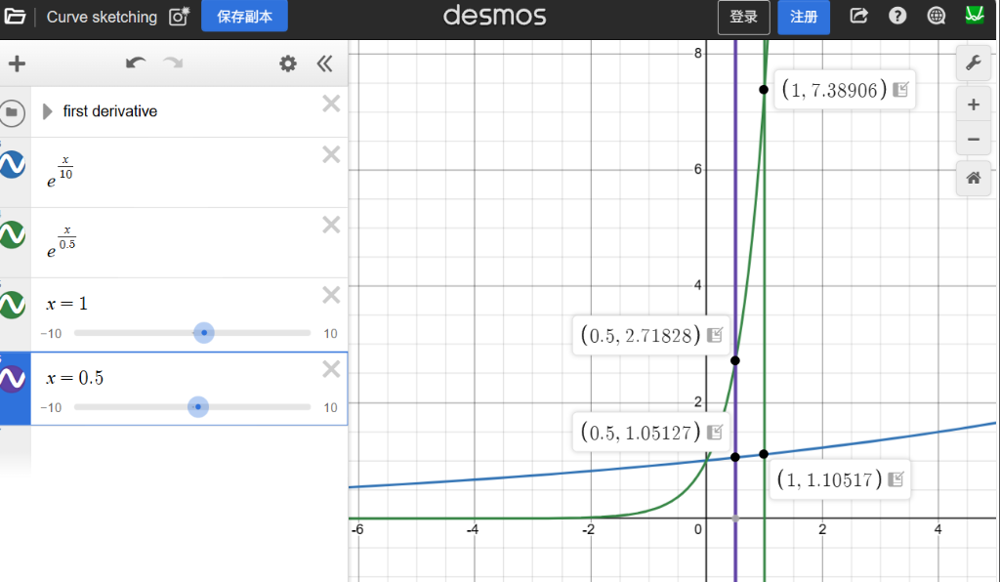
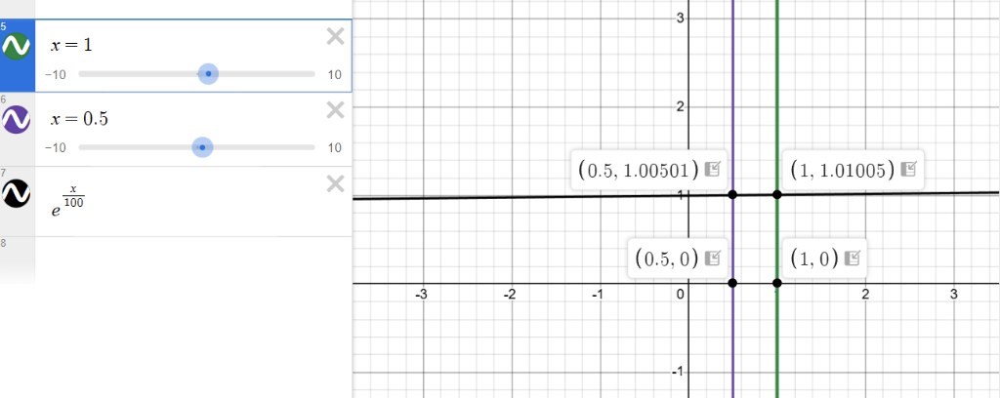

# 模型推理参数设置详解：Temperature 与 Sampling Params

## 上下文
本文档详细介绍了模型推理过程中 Temperature 参数的作用机制，并结合 SGLang 项目的实际实现进行说明。

## 核心内容

### Temperature 对模型输出的影响机制

Temperature（温度）参数通过调整模型输出的 logits 概率分布来影响生成结果的随机性和创造性。

> 在物理学中，温度是指系统能量的状态，用于描述系统的随机性。在模型推理中，温度参数的作用与此类似：较低的温度对应更确定性的输出（类似于低温系统的有序状态），较高的温度对应更随机的输出（类似于高温系统的无序状态）。这种类比有助于理解温度参数如何影响模型的生成行为：T越高，模型越随机，T越低，模型越确定。

#### 数学原理
温度的作用可以用公式表示：
$$P(x) = \frac{e^{z_i / T}}{\sum_j e^{z_j / T}}$$
其中：
- $z_i$ 是第 i 个 token 的原始 logit 值
- $T$ 是 temperature 值
- $P(x)$ 是最终的概率分布

#### Temperature 对概率分布的影响

| Temperature 值 | 对 logits 的影响 | 概率分布特征 | 输出效果 |
|----------------|------------------|--------------|----------|
| **T → 0** | 除以后趋近于无穷大 | 最大概率趋近于 1，其他趋近于 0 | 确定性极高，只选概率最高的 token |
| **T = 0.5** | 适当放大差异 | 概率分布较陡峭，集中在高概率 token | 输出较确定，偶尔有变化 |
| **T = 1.0** | 无缩放 | 原始概率分布 | 平衡的随机性和确定性 |
| **T = 1.5** | 缩小差异 | 概率分布较平缓，各 token 概率更接近 | 输出更多样，可能更有创意 |
| **T → ∞** | 除以后趋近于 0 | 所有 token 概率趋近于均匀分布 | 完全随机，输出混乱无意义 |

#### 具体示例：原始 logits 为 [3, 2, 1]

| Temperature | 缩放后的 logits | softmax 概率 | 输出倾向 |
|-------------|-----------------|--------------|----------|
| 0.1 | [30, 20, 10] | [≈1.0, ≈0, ≈0] | 几乎肯定选择第一个 token |
| 0.5 | [6, 4, 2] | [0.87, 0.12, 0.01] | 大概率选择第一个 token |
| 1.0 | [3, 2, 1] | [0.67, 0.24, 0.09] | 较可能选择第一个 token |
| 2.0 | [1.5, 1.0, 0.5] | [0.48, 0.31, 0.21] | 选择第一个 token 的概率降低，可能选择其他 token |

### 温度影响的可视化

#### 图 1：不同温度下的 logits 缩放效果



此图展示了当 logit 值为 0.5 和 1 时，不同温度下的指数函数值差异。可以看到，温度越低，差异越大；温度越高，差异越小。

#### 图 2：高温下的 logits 缩放效果



此图展示了当温度非常高时，不同 logit 值的指数函数值几乎相同，导致 softmax 后的概率分布趋近于均匀分布。


## 与 SGLang 项目的连接

在 SGLang 项目中，温度等采样参数通过 `SamplingParams` 类进行管理。

### SamplingParams 类的定义

**文件路径**：`sglang\python\sglang\srt\sampling\sampling_params.py`

```python
class SamplingParams:
    """
    The sampling parameters.

    See docs/backend/sampling_params.md or
    https://docs.sglang.io/backend/sampling_params.html
    for the documentation.
    """

    def __init__(
        self,
        max_new_tokens: int = 128,
        stop: Optional[Union[str, List[str]]] = None,
        stop_token_ids: Optional[List[int]] = None,
        stop_regex: Optional[Union[str, List[str]]] = None,
        temperature: float = 1.0,  # 默认温度为 1.0
        top_p: float = 1.0,
        top_k: int = -1,
        min_p: float = 0.0,
        frequency_penalty: float = 0.0,
        presence_penalty: float = 0.0,
        repetition_penalty: float = 1.0,
        min_new_tokens: int = 0,
        n: int = 1,
        # 其他参数...
    ) -> None:
        # 初始化代码...
        self.temperature = temperature if temperature is not None else 1.0
        # 其他参数初始化...
```

### 在 SGLang 中使用 SamplingParams

在 SGLang 中，您可以通过以下方式设置模型推理的温度参数：

1. **通过 API 请求设置**：
   - 在 OpenAI 兼容 API 中，通过 `temperature` 字段设置
   - 在 SGLang 原生 API 中，通过 `SamplingParams` 对象设置

2. **示例代码**：
   ```python
   from sglang.srt.sampling.sampling_params import SamplingParams

   # 创建采样参数对象
   sampling_params = SamplingParams(
       temperature=0.7,  # 设置温度为 0.7
       top_k=50,        # 设置 top_k 为 50
       top_p=0.95,      # 设置 top_p 为 0.95
       max_new_tokens=100
   )

   # 将采样参数传递给模型推理
   # 例如：model.generate(inputs, sampling_params=sampling_params)
   ```

## 参数调优建议

### 不同任务的参数配置
- **问答任务**：较低温度（0.2-0.5）+ 较高 Top-K（60-80）
- **创意写作**：较高温度（0.8-1.2）+ 较低 Top-K（30-50）
- **代码生成**：中等温度（0.6-0.8）+ 较高 Top-K（70-90）

### 注意事项
- Top-K 和 Top-P 通常不同时使用，选择一种即可
- 温度过高会导致输出质量下降，出现无意义内容
- 温度过低会导致输出过于保守，缺乏创意
- 不同模型版本可能有不同的最佳参数范围

## 总结

Temperature 通过缩放 logits 来调整概率分布的"尖锐度"，是控制模型输出风格和质量的关键参数之一。在 SGLang 项目中，通过 `SamplingParams` 类可以方便地设置和管理这些参数，为不同的任务场景选择合适的配置。

DeepSeek V4 等模型在推理时，合理设置温度参数可以显著影响生成结果的质量和多样性，需要根据具体任务类型和期望效果来选择合适的值。

## 相关文件/区域
- **SamplingParams 类**：`sglang\python\sglang\srt\sampling\sampling_params.py`
- **SGLang 文档**：`sglang\docs\basic_usage\sampling_params.md`
